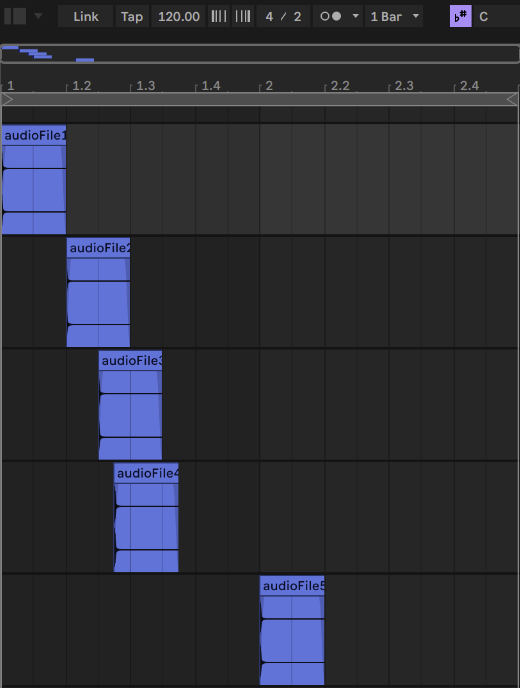

# react-native-audio-sync

Native iOS function to determine the synchronisation offset between two largely similar audio files

## Installation

```sh
npm install react-native-audio-sync
```

## Usage

A negative output indicates that audioFile1 is lagging behind audioFile2.

```js
import { calculateSyncOffset } from 'react-native-audio-sync';

calculateSyncOffset(
  `/path/to/audio/files/audioFile1.wav`,
  '/path/to/audio/files/audioFile2.wav'
)
  .then(({syncOffset}) => {
    console.log(`syncOffset: ${syncOffset}`);
  });
```

## Example app

The example app includes five WAV files in its app bundle, designed to demonstrate the synchronisation code.
They are each composed of two bars of silence in 4/4 at 120bpm but with the same hi-hat sample occurring at a different
interval in each.



From this, we should be able to make a few predictions:
- the time offset between audioFile1 and audioFile2 will be -1s, as in 4/4 at 120bpm each beat lasts a second, and we
can see from the image above that audioFile2 starts exactly one beat after audioFile1;
- the difference between audioFile1 and audioFile3 should be -1.5s, as audioFile3 starts a beat and a half after
audioFile1;
- subdividing again, audioFile1 and audioFile4 should have a time offset of -1.75s, and finally;
- audioFile5, starting a full bar after audioFile1, will have a time offset of -4s.

For good measure, based on these predictions, we can also easily imagine that audioFile4 starts 0.25s _after_ audioFile3

## Contributing

See the [contributing guide](CONTRIBUTING.md) to learn how to contribute to the repository and the development workflow.

## License

MIT

---

Made with [create-react-native-library](https://github.com/callstack/react-native-builder-bob)
